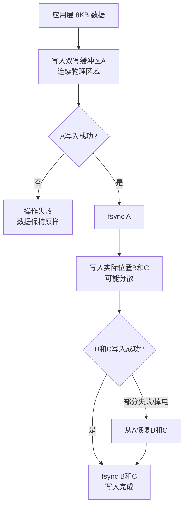
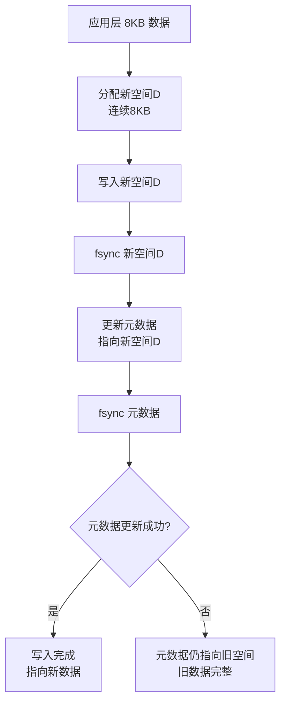
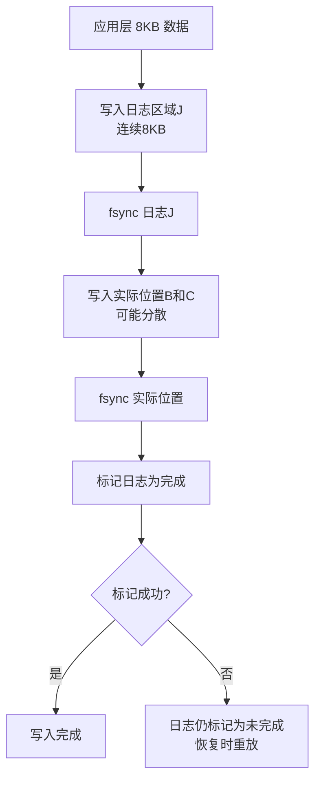
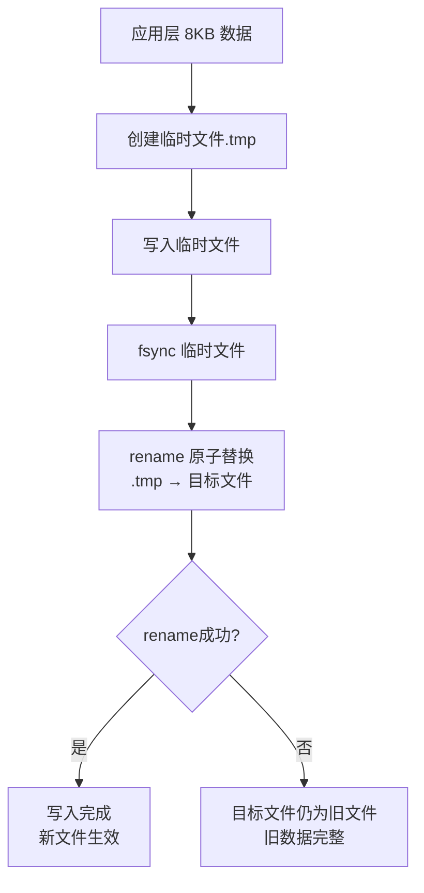

# 原子写入与双写机制

## 问题：双写是什么意思？Linux 写入是原子的吗？如何保证大于块大小的原子写？

### 1. 双写（Double Write）是什么？

**双写是工程实践中产生的技术**，最早在实际数据库系统中实现，用于解决部分写问题。

**历史背景：**
- 双写机制属于**工程实现**，不是纯学术论文的理论产物
- 最早在 InnoDB（MySQL 的存储引擎）中实现，用于解决 16KB page 的部分写问题
- 后来被其他数据库系统借鉴和采用
- 虽然有相关的学术论文讨论，但核心思想来自工程实践

**双写是数据库（如 InnoDB）的一种技术**，用于解决部分写问题：

```
正常写入：
数据 → page cache → 磁盘

双写机制：
数据 → page cache → 双写缓冲区 → 磁盘
                    ↓
              原子写入整个 page
```

**为什么需要双写？**

- 假设数据库 page 大小是 16KB，但磁盘扇区/块大小是 4KB
- 写入 16KB 需要分 4 次写入（4 × 4KB）
- 如果在第 3 次写入时掉电，page 就损坏了
- 双写先将整个 page 原子写入到一个连续区域，恢复时可以重建

### 2. Linux 系统中写入是原子的吗？

**答案：部分原子，取决于写入大小**

#### 原子写入的情况

1. **小于等于文件系统块大小（通常 4KB）**
   - 在某些文件系统上可能是原子的
   - 但不保证，取决于文件系统实现

2. **O_DIRECT + 对齐写入**
   - 如果写入大小等于物理扇区大小（通常 512B 或 4KB）
   - 可能是原子的，取决于存储设备

#### 不原子的情况

1. **大于块大小的写入**
   - 肯定不是原子的
   - 分多次写入，可能部分完成

2. **普通 write() 调用**
   - 不保证原子性
   - 可能被中断

### 3. 谁来保证原子性？

原子性的保证层次：

| 层次 | 保证内容 | 原子性 |
|------|---------|--------|
| 应用层 | 自定义逻辑 | 需自己实现 |
| 文件系统 | 块内写入 | 部分保证 |
| 块设备层 | 扇区写入 | 部分保证 |
| 存储介质 | 物理写入 | 硬件保证 |

**关键点**：
- 操作系统不保证跨块的原子写入
- 存储设备可能保证扇区级别的原子写入
- 应用层需要自己实现大于块大小的原子写入

### 4. 如何保证 8KB 的原子写（当块大小是 4KB）？

#### 方案 1：双写（Double Write）

**重要澄清**：双写缓冲区是磁盘上的连续物理区域，不是 page cache 中的连续区域。

**双写流程图：**



**磁盘布局示意图：**

```
磁盘布局：
+------------------+
|  双写缓冲区A     |  ← 连续的8KB物理区域
|  (8KB连续)       |
+------------------+
|  实际位置B       |  ← 可能分散
|  (4KB)           |
+------------------+
|  实际位置C       |  ← 可能分散
|  (4KB)           |
+------------------+
```

**正常写入流程：**

```
步骤：
1. 将 8KB 数据写入磁盘上的双写缓冲区（连续物理区域）
2. fsync() 确保双写缓冲区写入磁盘
3. 将 8KB 数据写入实际位置（可能不连续）
4. fsync() 确保实际位置写入磁盘

恢复：
- 如果实际位置损坏（掉电导致部分写），从双写缓冲区恢复
```

**为什么双写缓冲区能保证原子性？**

1. **双写缓冲区是连续的物理区域**
   - 预先分配在磁盘上的连续物理块
   - 虽然逻辑上可能不连续，但物理上是连续的
   - 存储设备控制器可以一次性写入

2. **存储设备的原子写入保证**
   - 某些存储设备保证连续物理块的原子写入
   - 或者通过 PLP（掉电保护）完成整个写入

3. **即使分两次写入，第一次掉电了**
   - 磁盘上的 4KB 不需要保留
   - 因为有完整的 8KB 在双写缓冲区
   - 恢复时直接从双写缓冲区复制整个 8KB

**关键问题：双写缓冲区A本身写入失败怎么办？**

这是一个非常好的问题！双写机制并不能完全解决所有问题：

1. **如果双写缓冲区A写入失败（包括fsync失败）**
   - fsync() 会返回错误（如 EIO）
   - 应用层收到错误，知道写入失败
   - 整个写入操作失败，不会继续写入实际位置
   - 数据保持原样（旧数据仍然完整）
   - 这是可接受的结果：要么成功，要么失败，不会部分损坏

2. **fsync A过程中磁盘故障，应用层如何感知？**
   - fsync() 系统调用会阻塞直到完成或失败
   - 如果磁盘故障，fsync() 会返回错误（通常 -1，errno = EIO）
   - 应用层检查返回值，知道写入失败
   - 应用层可以决定重试、报错或采取其他恢复措施

3. **为什么A写入失败的概率更低？**
   - A是连续的物理区域，存储设备可以一次性写入
   - 实际位置B和C可能分散在磁盘不同位置
   - 分散写入需要多次寻道，失败概率更高

4. **双写的真正作用**
   - 不是防止A写入失败
   - 而是防止B和C的部分写（写了一半掉电）
   - 如果A成功，B和C失败，可以从A恢复
   - 如果A失败，整个操作失败，数据保持一致

5. **双写的本质：将"部分损坏"转化为"完全失败"**
   - 完全失败是可接受的：数据保持一致，只是没有更新
   - 部分损坏是不可接受的：数据不一致，可能无法恢复
   - 双写通过备份机制，确保即使实际位置部分损坏，也能恢复

**双写的完整流程：**

```
步骤1: 写入双写缓冲区A
  ├─ 成功 → 继续
  └─ 失败 → 整个操作失败，数据保持原样

步骤2: fsync A

步骤3: 写入实际位置B和C
  ├─ 成功 → 继续
  └─ 部分失败（掉电）→ 从A恢复

步骤4: fsync B和C
  ├─ 成功 → 返回应用层成功
  └─ 失败 → 返回应用层失败
```

**问题：可以在fsync A后就返回应用层吗？**

**答案：可以，但需要异步写入和恢复机制**

有两种实现方式：

**方式1：同步写入（保守）**
- 写入A → fsync A → 写入B和C → fsync B和C → 返回成功
- 优点：数据已经在实际位置，不需要恢复
- 缺点：性能较差，需要两次磁盘写入

**方式2：异步写入（高性能）**
- 写入A → fsync A → 返回应用层成功 → 异步写入B和C
- 优点：性能更好，应用层更快收到成功响应
- 缺点：需要恢复机制，下次启动时检查并完成B和C的写入

**InnoDB 的实现：**
- 采用方式2（异步写入）
- fsync A后就返回成功
- 后台线程异步写入实际位置
- 恢复时检查双写缓冲区，恢复未完成的写入

**双写的本质：**

- 提供一个完整的备份
- 将"部分写损坏"转化为"完全失败"
- 完全失败是可接受的（数据保持一致）
- 部分损坏是不可接受的（数据不一致）

**关于 page cache 的误解**

- 双写不是依赖 page cache 的连续性
- page cache 中的数据在程序退出后会丢失
- 双写依赖的是磁盘上的连续物理区域
- fsync() 确保数据真正写入磁盘，而不是停留在 page cache

#### 方案 2：写时复制（COW）

**COW 流程图：**



**COW 磁盘布局示意图：**

```
写入前：
+------------------+
|  旧空间B+C       |  ← 元数据指向这里
|  (8KB分散)       |
+------------------+

写入中：
+------------------+
|  旧空间B+C       |  ← 元数据仍指向这里
|  (8KB分散)       |
+------------------+
|  新空间D         |  ← 正在写入
|  (8KB连续)       |
+------------------+

写入后：
+------------------+
|  旧空间B+C       |  ← 元数据不再指向
|  (8KB分散)       |
+------------------+
|  新空间D         |  ← 元数据指向这里
|  (8KB连续)       |
+------------------+
```

**正常写入流程：**

```
步骤：
1. 分配新的 8KB 空间
2. 将数据写入新空间
3. 更新元数据指向新空间
4. fsync() 元数据

恢复：
- 元数据更新是原子的（小块）
- 要么指向旧数据，要么指向新数据
```

#### 方案 3：日志（Journaling）

**日志流程图：**



**日志磁盘布局示意图：**

```
磁盘布局：
+------------------+
|  日志区域J       |  ← 连续的日志区域
|  (8KB连续)       |  ← 记录: 数据 + 目标位置 + 状态
+------------------+
|  实际位置B       |  ← 可能分散
|  (4KB)           |
+------------------+
|  实际位置C       |  ← 可能分散
|  (4KB)           |
+------------------+
```

**正常写入流程：**

```
步骤：
1. 将 8KB 数据写入日志（连续区域）
2. fsync() 日志
3. 将数据写入实际位置
4. fsync() 实际位置
5. 标记日志为完成

恢复：
- 检查日志，重放未完成的写入
```

#### 方案 4：原子文件替换

**原子文件替换流程图：**



**文件系统布局示意图：**

```
写入前：
+------------------+
|  目标文件        |  ← 用户看到的内容
|  (旧数据)        |
+------------------+

写入中：
+------------------+
|  目标文件        |  ← 用户仍看到旧内容
|  (旧数据)        |
+------------------+
|  目标文件.tmp    |  ← 正在写入
|  (新数据)        |
+------------------+

写入后：
+------------------+
|  目标文件        |  ← 用户看到新内容
|  (新数据)        |
+------------------+
|  (临时文件已删除)|
+------------------+
```

**正常写入流程：**

```
步骤：
1. 写入临时文件
2. fsync() 临时文件
3. rename() 原子替换目标文件

恢复：
- rename() 是原子的
- 要么旧文件，要么新文件
```

### 5. 代码示例：原子文件替换

```c
int atomic_write_file(const char *filename, const char *data, size_t size) {
    char tmp_filename[256];
    int fd;
    ssize_t bytes_written;

    // 创建临时文件名
    snprintf(tmp_filename, sizeof(tmp_filename), "%s.tmp", filename);

    // 写入临时文件
    fd = open(tmp_filename, O_WRONLY | O_CREAT | O_TRUNC, 0644);
    if (fd < 0) {
        perror("open");
        return -1;
    }

    bytes_written = write(fd, data, size);
    if (bytes_written < 0) {
        perror("write");
        close(fd);
        unlink(tmp_filename);
        return -1;
    }

    // fsync 确保数据写入磁盘
    if (fsync(fd) < 0) {
        perror("fsync");
        close(fd);
        unlink(tmp_filename);
        return -1;
    }

    close(fd);

    // 原子替换：rename() 是原子的
    if (rename(tmp_filename, filename) < 0) {
        perror("rename");
        unlink(tmp_filename);
        return -1;
    }

    return 0;
}
```

### 6. 数据库的实现

**InnoDB 的实现**：

- **Doublewrite Buffer**：128 个连续页面（1MB 或 2MB）
- 先写入 doublewrite buffer，再写入实际位置
- 恢复时从 doublewrite buffer 重建损坏的 page

**PostgreSQL 的实现**：

- **WAL (Write-Ahead Logging)**：先写日志，再写数据
- 恢复时重放日志

### 总结

- **双写**：数据库技术，用于解决部分写问题
- **Linux 写入原子性**：不保证跨块写入的原子性
- **保证责任**：应用层需要自己实现大于块大小的原子写入
- **解决方案**：
  - 双写（Double Write）
  - 写时复制（COW）
  - 日志（Journaling）
  - 原子文件替换（rename）
- **8KB 原子写**：通过上述软件机制实现，依赖文件系统的原子操作（如 rename）
